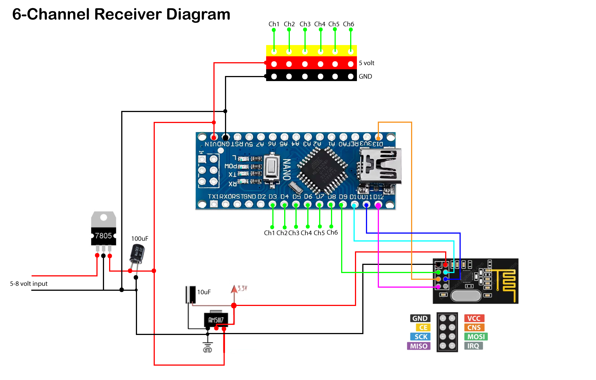

# Receiver Electronics
## Overview

The FlyControl-RC receiver is a six-channel RC receiver designed for the fixed-wing aircraft. It uses an Arduino Nano to process control data received wirelessly through an nRF24L01+ PA/LNA module and generates six PWM outputs for connection to the aircraft's control system.

## Wiring Diagram

The complete receiver wiring is shown below.

## Hardware Components

| Component | Quantity | Purpose |
|-----------|:--------:|---------|
| Arduino Nano | 1 | Main microcontroller that processes received data and generates PWM outputs. |
| nRF24L01+ PA/LNA | 1 | 2.4 GHz wireless transceiver for long-range communication. |
| AMS1117-3.3 Voltage Regulator | 1 | Provides a stable 3.3 V supply for the nRF24L01 module. |
| LM7805 Voltage Regulator | 1 | Regulates the input voltage to a stable 5 V for the receiver electronics. |
| 100 µF Electrolytic Capacitor | 1 | Smooths the input power supply and reduces voltage fluctuations. |
| 10 µF Electrolytic Capacitor | 1 | Placed near the nRF24L01 module to improve voltage stability during transmission and prevent brownouts. |
| Servo Headers | 6 | Provide PWM outputs for servos or a flight controller. |
| Power Connector | 1 | Receives power from the aircraft power source. |

## Circuit Operation

1. The nRF24L01 receives wireless packets from the transmitter.
2. The Arduino Nano decodes the received channel data.
3. Each channel is converted into a standard RC PWM signal.
4. Six PWM outputs are generated simultaneously for the aircraft servos or flight controller.
5. If communication is lost, the firmware activates the failsafe routine.

## Assembly

### Receiver Photo

### Installed in Aircraft

