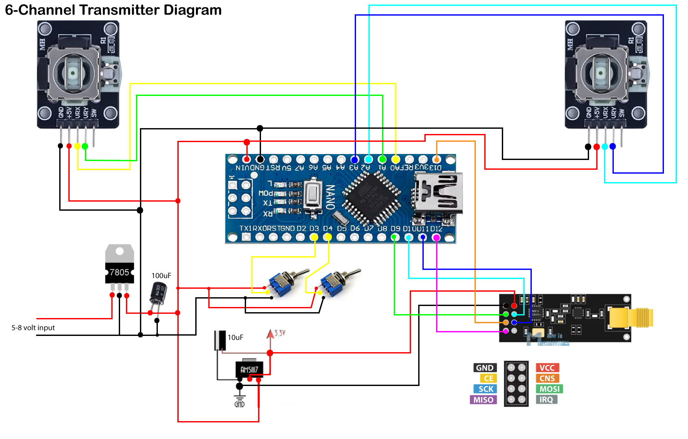

# Transmitter Electronics
## Overview

The FlyControl-RC transmitter is a six-channel RC transmitter designed for controlling the fixed-wing aircraft. It uses an Arduino Nano to read control inputs from the joysticks and switches and transmits the six-channel control data wirelessly through an nRF24L01+ PA/LNA module to the aircraft receiver.

## Wiring Diagram

The complete transmitter wiring is shown below.

## Hardware Components

| Component | Quantity | Purpose |
|-----------|:--------:|---------|
| Arduino Nano | 1 | Main microcontroller that reads the control inputs and prepares the six-channel control data for transmission. |
| nRF24L01+ PA/LNA | 1 | 2.4 GHz wireless transceiver for long-range communication with the aircraft receiver. |
| AMS1117-3.3 Voltage Regulator | 1 | Provides a stable 3.3 V supply for the nRF24L01 module. |
| LM7805 Voltage Regulator | 1 | Regulates the battery voltage to a stable 5 V supply for the transmitter electronics. |
| 100 µF Electrolytic Capacitor | 1 | Smooths the input power supply and reduces voltage fluctuations. |
| 10 µF Electrolytic Capacitor | 1 | Helps stabilize the 3.3 V supply near the nRF24L01 module during transmission. |
| Joystick Modules | 2 | Provide analog control inputs for aircraft movement. |
| Toggle Switches | 2 | Provide additional control inputs for auxiliary channels. |
| Power Switch | 1 | Turns the transmitter power supply on and off. |
| Battery | 1 | Provides power to the transmitter electronics. |

## Circuit Operation

1. The joysticks and switches provide the six control channel inputs.
2. The Arduino Nano reads the input values from each control channel.
3. The input values are converted into channel data for wireless transmission.
4. The nRF24L01+ PA/LNA module transmits the control packet to the aircraft receiver.
5. The transmitter continuously updates and sends the channel data while the system is powered on.

## Assembly

### Transmitter PCB transmitter_front.jpeg

### Completed Transmitter

   
