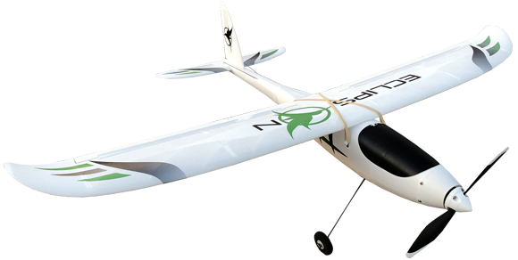

# FlyControl-RC

</svg>
     
 

&nbsp;•&nbsp;&nbsp;•&nbsp;&nbsp;•&nbsp;&nbsp;•&nbsp;

 

---

## Project Overview

FlyControl-RC is a custom RC transmitter and receiver system built to control a ready-made 3D-printed fixed-wing aircraft. The project covers electronics design, firmware development, wireless communication, custom transmitter enclosure design.

---

## Flight Simulation (PicaSim)

> Used **PicaSim** to practice flying and verify controller inputs before real flight testing.

*   **🖨️ Driver:** If Windows doesn't recognize the **FlySky RC transmitter** after connecting it via USB, install the driver. <a href="https://www.flysky-cn.com/g11pdownloads" target="_blank"><kbd>DOWNLOAD</kbd></a>

*   **⚙️ Calibration:** Tutorial for channel mapping and transmitter calibration. <a href="https://www.youtube.com/watch?v=ZL7RJNL25SQ&t=327s" target="_blank"><kbd>WATCH TUTORIAL</kbd></a>

---

## Electronics & Circuit Design

> 

---

## Design

> 

---

## Team
> 

